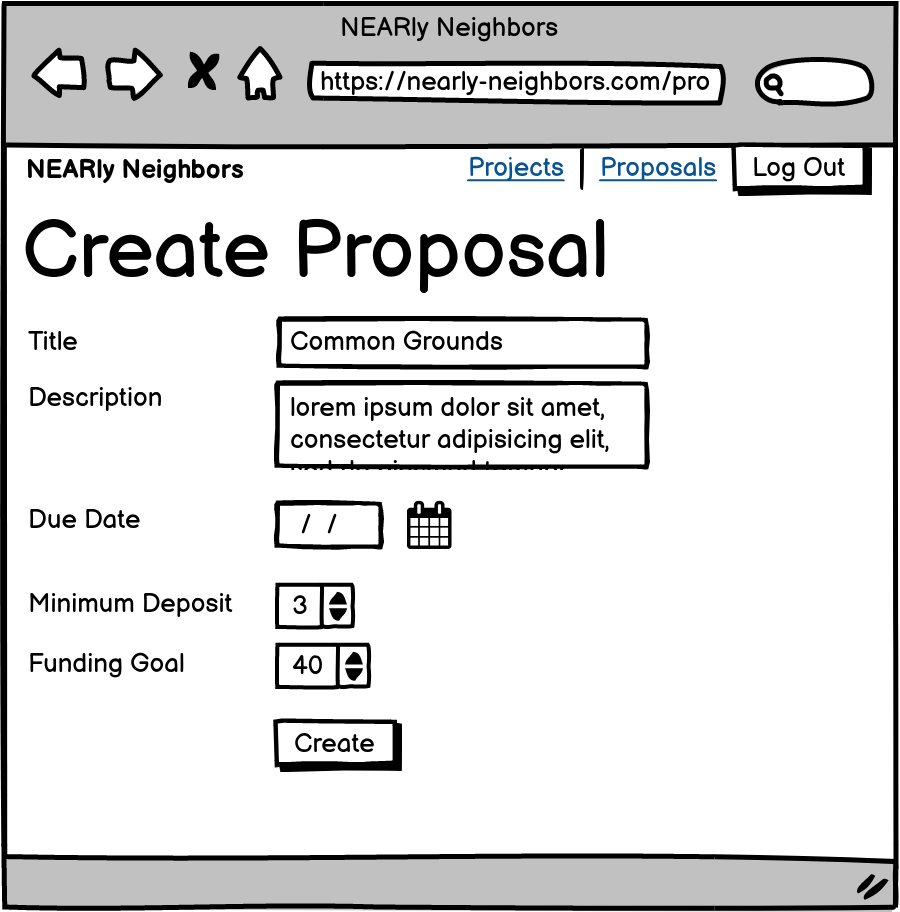
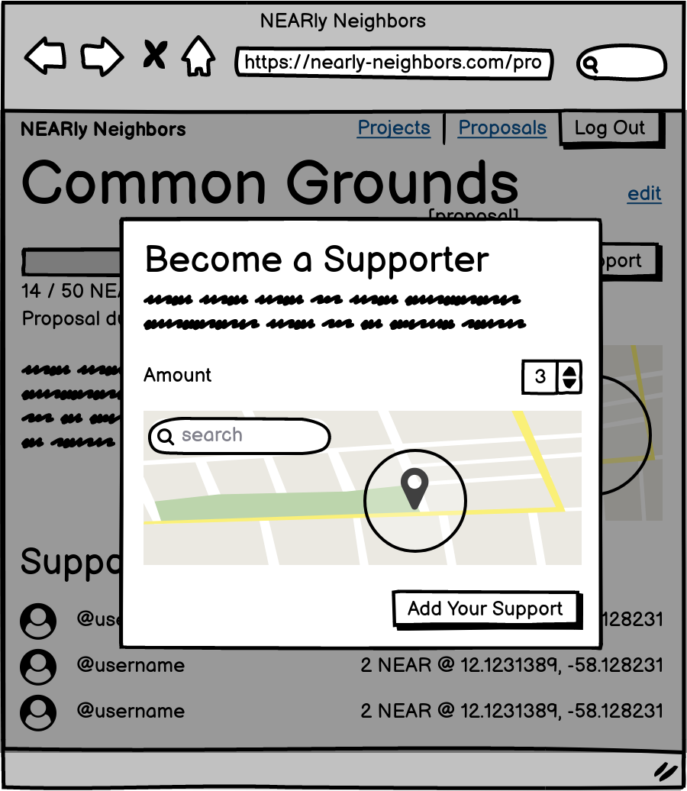
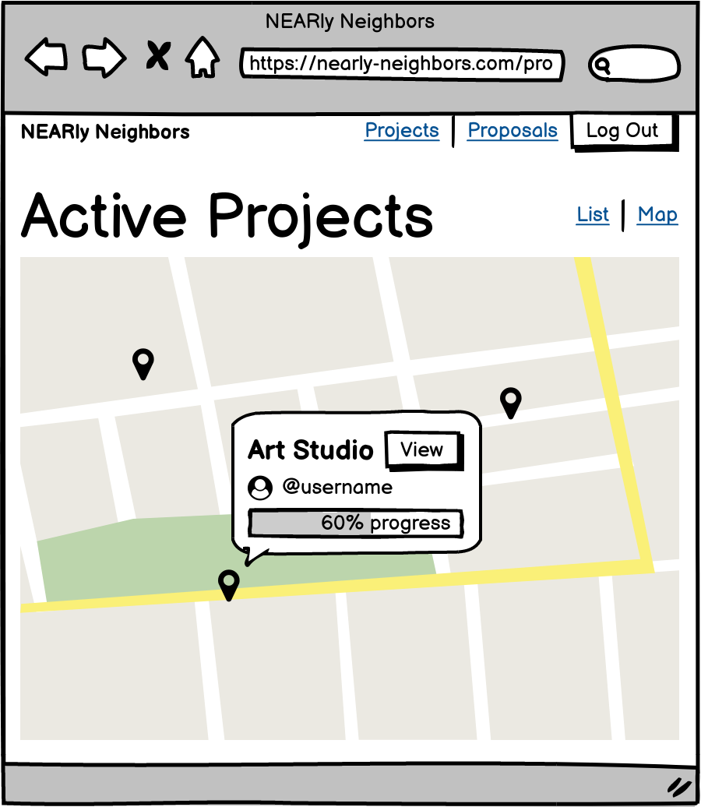

# Nearly Neighbors

A family of smart contracts developed for NEAR Protocol to enable crowd-sourced civic development. Think Kickstarter for neighborhood projects.

## ⚠️ Warning

Any content produced by NEAR, or developer resources that NEAR provides, are for educational and inspiration purposes only.  NEAR does not encourage, induce or sanction the deployment of any such applications in violation of applicable laws or regulations.

## Concept

The contracts provided here enable users to propose neighborhood development projects and crowd-source funding for them.

Think of it like Kickstarter, but instead of funding your roommate's sister's math rock band, you'd propose and fund projects like a new local park, grocery store, or community center. And the whole thing is powered by the NEAR protocol, so identity and financial tools are built in.

### Example Story

For the sake of this explanation, we'll assume three users: Alice, Bob, and Carol.

1. Alice notices that there isn't a good grocery store in her neighborhood, so she creates a new [proposal](#proposal) and sets a target funding goal of 10 NEAR tokens.
2. Bob lives nearby and also would like to have fresh produce, so he pledges 5 NEAR tokens to Alice's proposal with a geographic radius of 1km from his home.
3. Carol lives farther away, but she would still like to have a grocery store even if it is a longer walk, so she pledges another 5 NEAR to Alice's proposal with an allowed radius of 5km.
4. Now that the proposal is _fully funded_, it is transformed into a [project](#project). A new project account is created, and Bob and Carol's pledged NEAR tokens are transferred over. This project's geographic location is set to the area of overlap between Bob and Carol's specified radii.
5. Alice, as the project owner, now has access to the project funds to hire a contractor and build her grocery store!


- [Getting Started](#getting-started)
  - [Installation](#installation)
  - [Commands](#commands)
  - [Who This Is For](#who-this-is-for)
- [UI Wireframes](#ui-wireframes)
- [File Structure](#file-structure)
- [Contracts](#contracts)
  - [Proposal](#proposal)
  - [Project](#project)
  - [Factory](#factory)
- [Deploying](#deploying)
- [Contributing](#contributing)
  - [Future Development](#future-development)
  - [Key Contributors](#key-contributors)

---
## Getting Started

This repository is an example of a **dApp seed** project. **dApp seed** projects provide a stable foundation for developers to build a distributed application on top of. This includes:

- One or more [smart contracts](https://docs.near.org/docs/roles/developer/contracts/intro)
- [Unit tests](https://docs.near.org/docs/roles/developer/contracts/test-contracts#unit-tests) and [simulation tests](https://docs.near.org/docs/roles/developer/contracts/test-contracts#simulation-tests) for the contract(s)
- Wireframes and/or mockups for a potential dApp UI
- Utilities for building, testing, and deploying contracts (facilitated by the [NEAR CLI](https://docs.near.org/docs/development/near-cli))

### Installation

1. clone this repo
2. run `yarn install` (or `npm install`)
3. run `yarn build` (or `npm run build`)
4. run `yarn test` (or `npm run test`)
5. explore the contents of `src/`

See below for more convenience scripts ...

### Commands

**Compile source to WebAssembly**

```sh
yarn build                    # asb --target debug
yarn build:release            # asb
```

**Run unit tests**

```sh
yarn test:unit                # asp --verbose --nologo -f unit.spec
```

**Run simulation tests**

These tests can be run from within VSCode (or any Rust-compatible IDE) or from the command line.

_NOTE: Rust is required_

```sh
yarn test:simulate            # yarn build:release && cargo test -- --nocapture
```

**Run all tests**

```sh
yarn test                     # yarn test:unit && test:simulate
```

### Who This Is For

- Novice/intermediate Web3 devs looking for projects to practice on
- Developers new to the NEAR Protocol looking for a learning sandbox
- NEAR developers looking for inspiration

## UI Wireframes

More wireframes can be found in the `wireframes/` folder. Here are some examples showing how we envision the basic user interface elements.

**Create a Proposal**



**Supporting a Proposal**



**Map of Projects**



## File Structure

This contract is designed to be self-contained and so may be extracted into your own projects and used as a starting point.  If you do decide to use this code, please pay close attention to all top level files including:

- NodeJS artifacts
  - `package.json`: JavaScript project dependencies and several useful scripts

- AssemblyScript artifacts
  - `asconfig.json`: AssemblyScript project (and per contract) configuration including workspace configuration
  - `as-pect.config.js`: as-pect unit testing dependency
  - `src/tsconfig.json`: load TypeScript types
  - `src/as_types.ts`: AssemblyScript types header file
  - `src/as-pect.d.ts`: as-pect unit testing types header file

- Rust artifacts
  - `Cargo.toml`: Rust project dependencies and configuration
  - `Cargo.lock`: version-locked list of Rust project dependencies

The core file structure:

```
nearly-neighbors
├── README.md                           <-- this file
├── build                               <-- compiled contracts (WASM)
│   ├── debug
│   └── release
├── simulation
│   ├── Cargo.toml                      <-- simulation test config
│   └── src                             <-- simulation tests
│       ├── factory.rs
│       ├── lib.rs
│       ├── project.rs
│       └── proposal.rs
├── src
│   ├── factory                         <-- factory contract with:
│   │   ├── asconfig.json
│   │   ├── assembly                    <--   source code
│   │   │   └── index.ts
│   │   └── __tests__                   <--   unit tests
│   │       └── index.unit.spec.ts
│   ├── project                         <-- project contract with:
│   │   ├── asconfig.json
│   │   ├── assembly                    <--   source code
│   │   │   └── index.ts
│   │   └── __tests__                   <--   unit tests
│   │       └── index.unit.spec.ts
│   ├── proposal                        <-- proposal contract with:
│   │   ├── asconfig.json
│   │   ├── assembly                    <--   source code
│   │   │   └── index.ts
│   │   └── __tests__                   <--   unit tests
│   │       └── index.unit.spec.ts
│   └── utils.ts
└── wireframes                          <-- wireframe images
```

## Contracts

There are three contracts that make up this project.

By breaking out the logic into multiple contracts, we are employing NEAR development best practices which will make the code more secure (through rigorous testing of separated concerns) and robust (enabling complex features through [cross-contract calls](https://docs.near.org/docs/tutorials/how-to-write-contracts-that-talk-to-each-other)).

### Proposal

The proposal contract represents a user's proposed idea for a development project.

Proposals are created by users (mediated by the [factory](#factory)) and hold data like:

- Project details (what, where, why)
- Funding parameters (target amount, minimum pledge, due date)

The proposal accepts funding from _supporters_.

If proposals are fully funded by their due date, then they are closed and converted to a [project](#project) (with all funds transferred to the new project's account).
If proposals do not meet their funding goals, then they are closed and all funds are returned to the supporters.

### Project

The project contract represents a fully-funded proposal. It is managed by a _project owner_, who is authorized to access the project's NEAR tokens so that they can put those funds into use by actually executing on the real-world project.

Projects are created automatically by the [factory](#factory) from a fully-funded [proposal](#proposal). Projects maintain a reference to their original proposal for proper record-keeping.

Projects track their own real-world progress by reporting on key stats like:

- Amount of funds used
- % progress towards completion

### Factory

The factory is a behind-the-scenes contract which takes care of the creation and setup of [proposals](#proposal) and [projects](#project). Instead of human users creating proposal and project contracts directly, they instead send requests to the factory which handles the necessary tasks for them.

This is a pattern you'll see frequently in NEAR (and other blockchain) development: designating a contract with the responsibility for managing the lifecycle of other contracts. It helps abstract out the routine tasks of contract initialization and setup, limiting tedious user interactions and thus avoiding potential for user error.

## Deploying

TODO: Add referral to resources for deploying

## Contributing

There are two main ways you can contribute to this project:

1. **Build off of it**: we made this so that developers like you can build dApps more quickly and easily. Try building out a Web3 app on top of the provided [contracts](#contracts), using the wireframes as your guide.
2. **Enhance this dApp seed**: if you find a bug or an opportunity to enhance this repository, please submit an [issue](https://github.com/Learn-NEAR/nearly-neighbors/issues) and/or open a [pull request](https://github.com/Learn-NEAR/nearly-neighbors/pulls).

Interested in creating your own **dApp seed** and earning rewards for your efforts? Learn more: [TODO: ADD LINK / MORE COPY].

### Future Development

Some ideas for future feature development:

- Heatmaps showing the concentration of funding in particular geographic areas
- Notifications for proposal/project owners and supporters
- Algorithm for identifying ideal locations for a project, weighting the locations specified by supporters with their funding amount (i.e. more funding == more likely to use specified location)

### Key Contributors

- [Sherif Abushadi - @amgando](https://github.com/amgando)
- [Tanner Welsh - @tannerwelsh](https://github.com/tannerwelsh)
